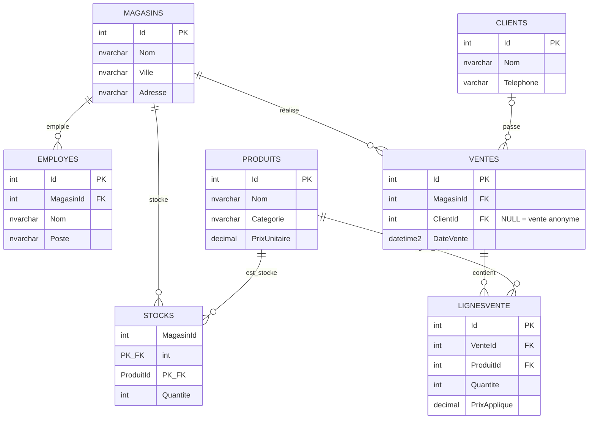

# ERD — SuperetteCG

Schéma OLTP en 3NF, 7 tables (voir `sql/01_creation_base_superettecg.sql` pour le DDL complet et les contraintes).

## Notes de lecture
- `STOCKS` a une clé primaire composite `(MagasinId, ProduitId)` — une ligne par couple magasin/produit.
- `VENTES.ClientId` est nullable (achat anonyme en superette) ; toutes les autres FK du schéma sont obligatoires.
- La couche BI (`vw_FaitVentes`, `vw_DimProduit`, `vw_DimMagasin`, `vw_DimClient` — voir `sql/03_procedures_vues_superettecg.sql`) reprojette ce schéma OLTP en modèle étoile simplifié pour Power BI, sans dupliquer `LIGNESVENTE`/`VENTES` en table de faits séparée.
